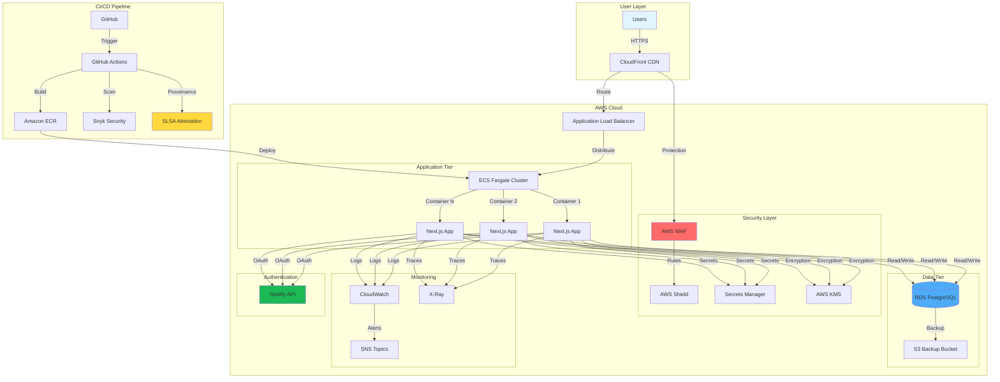
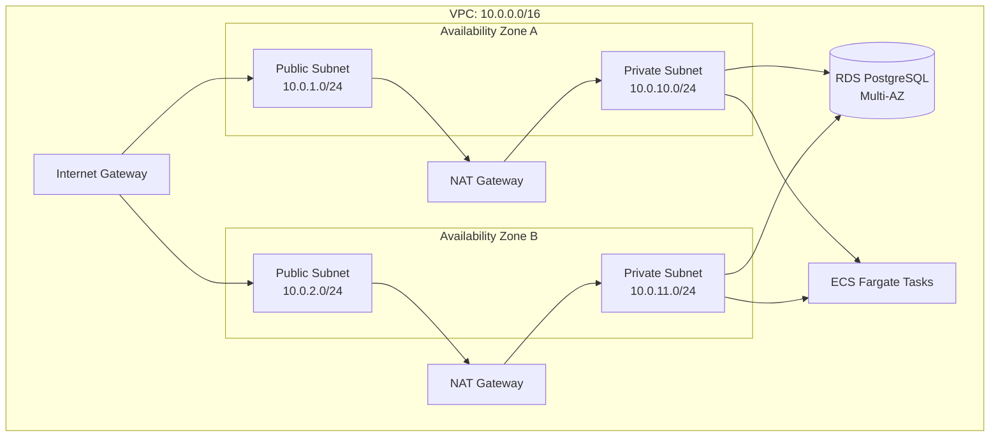
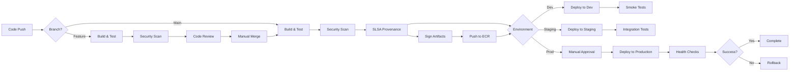
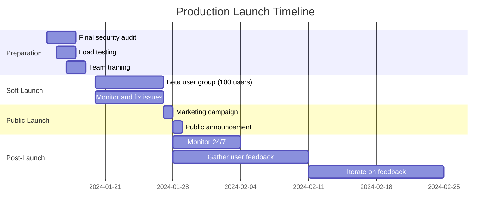
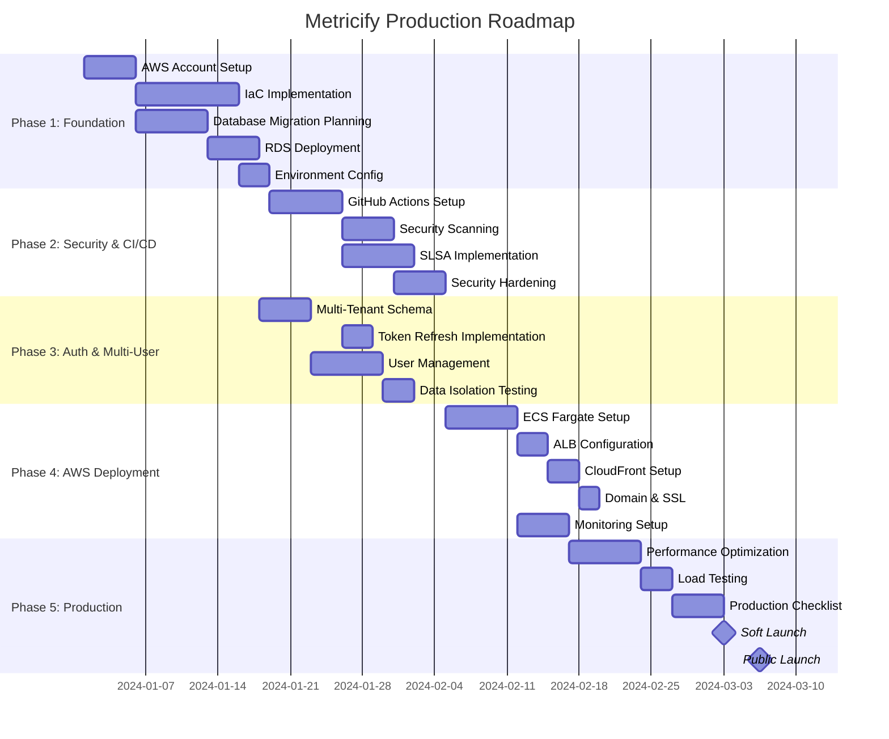

# Metricify - Interactive Technical Roadmap

> **Vision:** Transform Metricify from a local Spotify analytics dashboard into a secure, publicly-hosted multi-user platform on AWS with enterprise-grade CI/CD and SLSA framework compliance.

---

## Table of Contents

- [Project Overview](#project-overview)
- [Current State Assessment](#current-state-assessment)
- [Strategic Goals](#strategic-goals)
- [High-Level Architecture](#high-level-architecture)
- [Implementation Phases](#implementation-phases)
  - [Phase 1: Foundation & Infrastructure Setup](#phase-1-foundation--infrastructure-setup)
  - [Phase 2: Security & CI/CD Implementation](#phase-2-security--cicd-implementation)
  - [Phase 3: Authentication & Multi-User Support](#phase-3-authentication--multi-user-support)
  - [Phase 4: AWS Deployment](#phase-4-aws-deployment)
  - [Phase 5: Metrics & Production Readiness](#phase-5-metrics--production-readiness)
- [SLSA Framework Compliance](#slsa-framework-compliance)
- [Success Metrics](#success-metrics)
- [Risk Mitigation](#risk-mitigation)

---

## Project Overview

**Metricify** is a comprehensive Spotify analytics platform that provides users with detailed insights into their listening habits, featuring advanced visualizations, trend analysis, and personalized music statistics.

### Current Technology Stack
- **Frontend:** Next.js 15.0.3 (App Router), React 18.3.1, TypeScript 5
- **UI Framework:** Chakra UI 2.10.4, Framer Motion 11.15.0
- **Data Visualization:** Chart.js 4.4.1, Recharts 2.12.0
- **Backend:** Next.js API Routes, NextAuth.js 4.24.11
- **Database:** Better-SQLite3 11.0.0 (file-based)
- **Containerization:** Docker, Docker Compose
- **Authentication:** Spotify OAuth 2.0

---

## Current State Assessment

### Maturity Level: **Development (Local)**

| Dimension | Current State | Target State |
|-----------|--------------|--------------|
| **Deployment** | Local development only | Multi-region AWS production |
| **Authentication** | Single-user Spotify OAuth | Multi-tenant Spotify SSO |
| **Database** | SQLite (local file) | RDS PostgreSQL (managed) |
| **CI/CD** | Manual builds | Automated GitHub Actions pipeline |
| **Security** | Basic (env vars, Docker) | Enterprise-grade (WAF, encryption, SLSA) |
| **SLSA Level** | 0-1 | Level 3 (Build + Source) |
| **Scalability** | Single instance | Auto-scaling, load balanced |
| **Monitoring** | None | CloudWatch, X-Ray, alerting |

### Key Gaps Identified
- ❌ No public hosting infrastructure
- ❌ No multi-user support
- ❌ No CI/CD pipeline
- ❌ No automated testing
- ❌ No SLSA compliance
- ❌ Limited security controls
- ❌ No secrets management
- ❌ No production database

---

## Strategic Goals

### Goal 1: Make Webapp Publicly Hosted on AWS ☁️
**Objective:** Deploy Metricify to AWS with production-grade infrastructure

**Key Results:**
- [ ] Application accessible via custom domain with HTTPS
- [ ] 99.9% uptime SLA
- [ ] Auto-scaling based on demand
- [ ] CDN for global performance
- [ ] Infrastructure fully automated (IaC)

### Goal 2: User Login via Spotify SSO 🔐
**Objective:** Enable any Spotify user to authenticate and access their personalized dashboard

**Key Results:**
- [ ] Multi-tenant architecture supporting unlimited users
- [ ] Secure OAuth 2.0 flow with token refresh
- [ ] User session management with security best practices
- [ ] Privacy controls and data isolation
- [ ] Compliance with Spotify API terms

### Goal 3: Display Custom Metrics for All Users 📊
**Objective:** Provide personalized analytics for every authenticated user

**Key Results:**
- [ ] User-specific data isolation in database
- [ ] Real-time metrics updates
- [ ] Historical trend analysis per user
- [ ] Scalable data processing
- [ ] Performance optimization for concurrent users

### Goal 4: Secure CI/CD Process 🔄
**Objective:** Implement automated, secure software delivery lifecycle

**Key Results:**
- [ ] Automated build, test, and deployment pipeline
- [ ] Security scanning at every stage (SAST, DAST, SCA)
- [ ] Environment promotion (dev → staging → prod)
- [ ] Rollback capabilities
- [ ] Audit logging for all deployments

### Goal 5: SLSA Framework Compliance ✅
**Objective:** Achieve SLSA Level 3 for build and source integrity

**Key Results:**
- [ ] SLSA Build Level 3 certification
- [ ] SLSA Source Level 2 minimum
- [ ] Build provenance generation and verification
- [ ] Signed container images
- [ ] Two-person review for production changes

---

## High-Level Architecture



---

## Implementation Phases

### Phase 1: Foundation & Infrastructure Setup

**Duration:** 3-4 weeks | **Priority:** Critical | **Dependencies:** None

#### 1.1 AWS Account Setup & Governance

**Tasks:**
- [ ] Create AWS Organization with multi-account strategy
  - [ ] Management account
  - [ ] Development account
  - [ ] Staging account
  - [ ] Production account
- [ ] Configure AWS IAM roles and policies (least privilege)
- [ ] Set up AWS Control Tower for guardrails
- [ ] Enable AWS CloudTrail for audit logging
- [ ] Configure billing alerts and cost management

**Technical Specifications:**
```yaml
# AWS Account Structure
Organization:
  ManagementAccount: metricify-root
  OUs:
    - Development
    - Staging
    - Production

Policies:
  - Service Control Policies (SCPs)
  - Tag enforcement policies
  - Region restrictions (us-east-1, us-west-2)
```

**Success Criteria:**
- ✅ All accounts created with MFA enabled
- ✅ Cross-account IAM roles configured
- ✅ CloudTrail enabled in all regions
- ✅ Budget alerts configured

---

#### 1.2 Infrastructure as Code (IaC) Setup

**Tasks:**
- [ ] Initialize Terraform workspace (or AWS CDK alternative)
- [ ] Create VPC architecture with public/private subnets
- [ ] Configure network ACLs and security groups
- [ ] Set up NAT Gateway for private subnet internet access
- [ ] Implement VPC Flow Logs for network monitoring

**Architecture Diagram:**


**Terraform Structure:**
```
terraform/
├── environments/
│   ├── dev/
│   │   ├── main.tf
│   │   ├── variables.tf
│   │   └── terraform.tfvars
│   ├── staging/
│   └── production/
├── modules/
│   ├── vpc/
│   ├── ecs/
│   ├── rds/
│   ├── cloudfront/
│   └── security/
└── global/
    ├── iam/
    └── route53/
```

**Success Criteria:**
- ✅ VPC deployed across 2 AZs
- ✅ Network segmentation implemented
- ✅ Terraform state stored in S3 with locking (DynamoDB)
- ✅ Infrastructure can be torn down and rebuilt

---

#### 1.3 Database Migration Strategy

**Current State:** SQLite (local file)
**Target State:** Amazon RDS PostgreSQL (Multi-AZ)

**Migration Tasks:**
- [ ] Design PostgreSQL schema with multi-tenancy
- [ ] Add `user_id` to all tables for data isolation
- [ ] Create migration scripts (SQLite → PostgreSQL)
- [ ] Set up RDS instance with encryption at rest
- [ ] Configure automated backups (point-in-time recovery)
- [ ] Implement read replicas for scaling

**Schema Updates:**

```sql
-- Updated schema for multi-tenant support

CREATE TABLE users (
    user_id UUID PRIMARY KEY DEFAULT gen_random_uuid(),
    spotify_id VARCHAR(255) UNIQUE NOT NULL,
    email VARCHAR(255),
    display_name VARCHAR(255),
    created_at TIMESTAMP DEFAULT CURRENT_TIMESTAMP,
    updated_at TIMESTAMP DEFAULT CURRENT_TIMESTAMP,
    last_login TIMESTAMP,
    INDEX idx_spotify_id (spotify_id)
);

CREATE TABLE listening_history (
    id BIGSERIAL PRIMARY KEY,
    user_id UUID NOT NULL REFERENCES users(user_id) ON DELETE CASCADE,
    track_id VARCHAR(255) NOT NULL,
    track_name VARCHAR(500),
    artist_name VARCHAR(500),
    album_name VARCHAR(500),
    played_at TIMESTAMP NOT NULL,
    duration_ms INTEGER,
    -- Audio features
    danceability FLOAT,
    energy FLOAT,
    valence FLOAT,
    tempo FLOAT,
    loudness FLOAT,
    acousticness FLOAT,
    instrumentalness FLOAT,
    speechiness FLOAT,
    created_at TIMESTAMP DEFAULT CURRENT_TIMESTAMP,
    INDEX idx_user_played (user_id, played_at),
    INDEX idx_track_id (track_id)
);

CREATE TABLE artist_plays (
    id BIGSERIAL PRIMARY KEY,
    user_id UUID NOT NULL REFERENCES users(user_id) ON DELETE CASCADE,
    artist_id VARCHAR(255) NOT NULL,
    artist_name VARCHAR(500),
    play_count INTEGER DEFAULT 1,
    last_played TIMESTAMP,
    genres TEXT[], -- PostgreSQL array
    created_at TIMESTAMP DEFAULT CURRENT_TIMESTAMP,
    updated_at TIMESTAMP DEFAULT CURRENT_TIMESTAMP,
    UNIQUE (user_id, artist_id),
    INDEX idx_user_artist (user_id, play_count DESC)
);

CREATE TABLE genre_trends (
    id BIGSERIAL PRIMARY KEY,
    user_id UUID NOT NULL REFERENCES users(user_id) ON DELETE CASCADE,
    genre VARCHAR(255) NOT NULL,
    date DATE NOT NULL,
    play_count INTEGER DEFAULT 1,
    unique_tracks INTEGER DEFAULT 1,
    total_duration_ms BIGINT DEFAULT 0,
    created_at TIMESTAMP DEFAULT CURRENT_TIMESTAMP,
    UNIQUE (user_id, genre, date),
    INDEX idx_user_genre_date (user_id, genre, date)
);

CREATE TABLE user_statistics (
    id BIGSERIAL PRIMARY KEY,
    user_id UUID NOT NULL REFERENCES users(user_id) ON DELETE CASCADE,
    snapshot_date DATE NOT NULL,
    total_tracks INTEGER DEFAULT 0,
    total_artists INTEGER DEFAULT 0,
    total_listening_time_ms BIGINT DEFAULT 0,
    top_genre VARCHAR(255),
    avg_track_duration_ms INTEGER,
    -- Listening patterns
    avg_danceability FLOAT,
    avg_energy FLOAT,
    avg_valence FLOAT,
    created_at TIMESTAMP DEFAULT CURRENT_TIMESTAMP,
    UNIQUE (user_id, snapshot_date),
    INDEX idx_user_snapshot (user_id, snapshot_date)
);

-- Enable Row Level Security (RLS) for additional data isolation
ALTER TABLE listening_history ENABLE ROW LEVEL SECURITY;
ALTER TABLE artist_plays ENABLE ROW LEVEL SECURITY;
ALTER TABLE genre_trends ENABLE ROW LEVEL SECURITY;
ALTER TABLE user_statistics ENABLE ROW LEVEL SECURITY;

-- Create policies for user data access
CREATE POLICY user_listening_history_policy ON listening_history
    FOR ALL USING (user_id = current_setting('app.current_user_id')::UUID);

CREATE POLICY user_artist_plays_policy ON artist_plays
    FOR ALL USING (user_id = current_setting('app.current_user_id')::UUID);

CREATE POLICY user_genre_trends_policy ON genre_trends
    FOR ALL USING (user_id = current_setting('app.current_user_id')::UUID);

CREATE POLICY user_statistics_policy ON user_statistics
    FOR ALL USING (user_id = current_setting('app.current_user_id')::UUID);
```

**RDS Configuration:**
```yaml
DBInstance:
  Engine: postgres
  EngineVersion: "15.4"
  InstanceClass: db.t4g.medium  # ARM-based Graviton2
  AllocatedStorage: 100GB
  StorageType: gp3
  StorageEncrypted: true
  KmsKeyId: alias/metricify-rds

  MultiAZ: true  # High availability

  BackupRetentionPeriod: 30  # days
  PreferredBackupWindow: "03:00-04:00"
  PreferredMaintenanceWindow: "Mon:04:00-Mon:05:00"

  EnablePerformanceInsights: true
  PerformanceInsightsRetentionPeriod: 7

  VPCSecurityGroups:
    - metricify-rds-sg
  DBSubnetGroupName: metricify-db-subnet-group

  DeletionProtection: true  # Production only

ReadReplicas:
  - Identifier: metricify-rds-read-replica-1
    SourceDBInstanceIdentifier: metricify-rds-primary
    AvailabilityZone: us-east-1b
```

**Migration Script:**
```javascript
// scripts/migrate-sqlite-to-postgres.js
const Database = require('better-sqlite3');
const { Pool } = require('pg');

async function migrateSQLiteToPostgres() {
  const sqlite = new Database('./data/metricify.db', { readonly: true });
  const pgPool = new Pool({
    host: process.env.POSTGRES_HOST,
    database: process.env.POSTGRES_DB,
    user: process.env.POSTGRES_USER,
    password: process.env.POSTGRES_PASSWORD,
    ssl: { rejectUnauthorized: false }
  });

  // Migration logic with batching and error handling
  // ...implementation details...
}
```

**Success Criteria:**
- ✅ RDS instance provisioned in private subnets
- ✅ Encryption at rest enabled with KMS
- ✅ Automated backups configured
- ✅ Multi-tenancy schema validated
- ✅ Migration script tested in dev environment

---

#### 1.4 Environment Configuration Management

**Tasks:**
- [ ] Set up AWS Systems Manager Parameter Store
- [ ] Migrate environment variables to Secrets Manager
- [ ] Configure different parameter sets for each environment
- [ ] Implement secret rotation policies

**Parameter Structure:**
```
/metricify/dev/
  ├── /database/
  │   ├── host
  │   ├── port
  │   ├── name
  │   └── credentials (SecureString)
  ├── /spotify/
  │   ├── client_id
  │   └── client_secret (SecureString)
  ├── /nextauth/
  │   ├── url
  │   └── secret (SecureString)
  └── /app/
      └── environment

/metricify/staging/
  └── (same structure)

/metricify/production/
  └── (same structure)
```

**Success Criteria:**
- ✅ All secrets stored in AWS Secrets Manager
- ✅ Automatic rotation enabled for database credentials
- ✅ Application can retrieve secrets at runtime
- ✅ No hardcoded secrets in codebase

---

### Phase 2: Security & CI/CD Implementation

**Duration:** 4-5 weeks | **Priority:** Critical | **Dependencies:** Phase 1

#### 2.1 GitHub Actions CI/CD Pipeline

**Pipeline Stages:**



**Workflow Files:**

`.github/workflows/ci.yml`:
```yaml
name: Continuous Integration

on:
  pull_request:
    branches: [main, develop]
  push:
    branches: [main, develop]

permissions:
  contents: read
  security-events: write
  id-token: write  # For SLSA provenance

env:
  NODE_VERSION: '18'
  REGISTRY: ${{ secrets.AWS_ECR_REGISTRY }}
  IMAGE_NAME: metricify

jobs:
  build-and-test:
    name: Build and Test
    runs-on: ubuntu-latest

    steps:
      - name: Checkout code
        uses: actions/checkout@v4
        with:
          fetch-depth: 0  # Full history for SLSA

      - name: Setup Node.js
        uses: actions/setup-node@v4
        with:
          node-version: ${{ env.NODE_VERSION }}
          cache: 'npm'

      - name: Install dependencies
        run: npm ci

      - name: Run linter
        run: npm run lint

      - name: Run type check
        run: npx tsc --noEmit

      - name: Run unit tests
        run: npm test
        env:
          CI: true

      - name: Build application
        run: npm run build

      - name: Upload build artifacts
        uses: actions/upload-artifact@v4
        with:
          name: build-artifacts
          path: .next/
          retention-days: 7

  security-scan:
    name: Security Scanning
    runs-on: ubuntu-latest
    needs: build-and-test

    steps:
      - name: Checkout code
        uses: actions/checkout@v4

      - name: Run Snyk dependency scan
        uses: snyk/actions/node@master
        env:
          SNYK_TOKEN: ${{ secrets.SNYK_TOKEN }}
        with:
          args: --severity-threshold=high

      - name: Run Snyk code analysis (SAST)
        uses: snyk/actions/node@master
        env:
          SNYK_TOKEN: ${{ secrets.SNYK_TOKEN }}
        with:
          command: code test

      - name: Run Trivy vulnerability scanner
        uses: aquasecurity/trivy-action@master
        with:
          scan-type: 'fs'
          scan-ref: '.'
          format: 'sarif'
          output: 'trivy-results.sarif'

      - name: Upload Trivy results to GitHub Security
        uses: github/codeql-action/upload-sarif@v3
        with:
          sarif_file: 'trivy-results.sarif'

      - name: Check for secrets in code
        uses: trufflesecurity/trufflehog@main
        with:
          path: ./
          base: ${{ github.event.repository.default_branch }}
          head: HEAD

  docker-build:
    name: Build and Scan Container
    runs-on: ubuntu-latest
    needs: security-scan
    if: github.event_name == 'push'

    steps:
      - name: Checkout code
        uses: actions/checkout@v4

      - name: Set up Docker Buildx
        uses: docker/setup-buildx-action@v3

      - name: Build Docker image
        uses: docker/build-push-action@v5
        with:
          context: .
          push: false
          tags: ${{ env.IMAGE_NAME }}:${{ github.sha }}
          cache-from: type=gha
          cache-to: type=gha,mode=max
          outputs: type=docker,dest=/tmp/image.tar

      - name: Scan container with Trivy
        uses: aquasecurity/trivy-action@master
        with:
          input: '/tmp/image.tar'
          format: 'table'
          severity: 'CRITICAL,HIGH'
          exit-code: '1'

      - name: Upload image artifact
        uses: actions/upload-artifact@v4
        with:
          name: docker-image
          path: /tmp/image.tar
          retention-days: 1
```

`.github/workflows/cd-production.yml`:
```yaml
name: Deploy to Production

on:
  workflow_dispatch:
    inputs:
      environment:
        description: 'Target environment'
        required: true
        type: choice
        options:
          - production
  push:
    tags:
      - 'v*.*.*'

permissions:
  contents: read
  id-token: write
  packages: write

env:
  AWS_REGION: us-east-1
  ECS_CLUSTER: metricify-prod
  ECS_SERVICE: metricify-service
  REGISTRY: ${{ secrets.AWS_ECR_REGISTRY }}

jobs:
  deploy:
    name: Deploy to Production
    runs-on: ubuntu-latest
    environment:
      name: production
      url: https://metricify.app

    steps:
      - name: Checkout code
        uses: actions/checkout@v4
        with:
          fetch-depth: 0

      - name: Configure AWS credentials
        uses: aws-actions/configure-aws-credentials@v4
        with:
          role-to-assume: ${{ secrets.AWS_DEPLOY_ROLE_ARN }}
          aws-region: ${{ env.AWS_REGION }}

      - name: Login to Amazon ECR
        id: login-ecr
        uses: aws-actions/amazon-ecr-login@v2

      - name: Download docker image
        uses: actions/download-artifact@v4
        with:
          name: docker-image
          path: /tmp

      - name: Load and tag image
        run: |
          docker load --input /tmp/image.tar
          docker tag ${{ env.IMAGE_NAME }}:${{ github.sha }} \
            ${{ env.REGISTRY }}/${{ env.IMAGE_NAME }}:${{ github.sha }}
          docker tag ${{ env.REGISTRY }}/${{ env.IMAGE_NAME }}:${{ github.sha }} \
            ${{ env.REGISTRY }}/${{ env.IMAGE_NAME }}:latest

      - name: Generate SLSA provenance
        uses: slsa-framework/slsa-github-generator/.github/workflows/generator_container_slsa3.yml@v1.9.0
        with:
          image: ${{ env.REGISTRY }}/${{ env.IMAGE_NAME }}
          digest: ${{ steps.build.outputs.digest }}

      - name: Sign container image with Cosign
        uses: sigstore/cosign-installer@v3

      - name: Sign the container
        run: |
          cosign sign --yes \
            ${{ env.REGISTRY }}/${{ env.IMAGE_NAME }}@${{ steps.build.outputs.digest }}

      - name: Push image to ECR
        run: |
          docker push ${{ env.REGISTRY }}/${{ env.IMAGE_NAME }}:${{ github.sha }}
          docker push ${{ env.REGISTRY }}/${{ env.IMAGE_NAME }}:latest

      - name: Deploy to ECS
        run: |
          aws ecs update-service \
            --cluster ${{ env.ECS_CLUSTER }} \
            --service ${{ env.ECS_SERVICE }} \
            --force-new-deployment \
            --region ${{ env.AWS_REGION }}

      - name: Wait for service stability
        run: |
          aws ecs wait services-stable \
            --cluster ${{ env.ECS_CLUSTER }} \
            --services ${{ env.ECS_SERVICE }} \
            --region ${{ env.AWS_REGION }}

      - name: Run smoke tests
        run: |
          curl -f https://metricify.app/api/health || exit 1

      - name: Notify deployment success
        uses: 8398a7/action-slack@v3
        if: success()
        with:
          status: custom
          custom_payload: |
            {
              text: "✅ Production deployment successful",
              attachments: [{
                color: 'good',
                text: `Version: ${{ github.sha }}\nEnvironment: production`
              }]
            }
        env:
          SLACK_WEBHOOK_URL: ${{ secrets.SLACK_WEBHOOK }}
```

**Success Criteria:**
- ✅ CI pipeline runs on all PRs
- ✅ CD pipeline deploys to dev/staging automatically
- ✅ Production requires manual approval
- ✅ All security scans pass before deployment
- ✅ Rollback capability tested

---

#### 2.2 SLSA Framework Implementation

**SLSA Level 3 Requirements:**

| Requirement | Implementation | Status |
|-------------|----------------|--------|
| **Build L3: Source verified** | GitHub Actions with verified commits | [ ] |
| **Build L3: Hosted build service** | GitHub Actions (SLSA certified) | [ ] |
| **Build L3: Provenance** | slsa-github-generator | [ ] |
| **Build L3: Hermetic builds** | Docker multi-stage builds | [ ] |
| **Build L3: Isolated builds** | GitHub-hosted runners (ephemeral) | [ ] |
| **Source L2: Version controlled** | GitHub repository | [ ] |
| **Source L2: Verified history** | Branch protection + signed commits | [ ] |
| **Source L2: Retained history** | GitHub retention (indefinite) | [ ] |

**SLSA Provenance Generation:**

```yaml
# .github/workflows/slsa-provenance.yml
name: SLSA Provenance

on:
  workflow_call:
    inputs:
      image-digest:
        required: true
        type: string

permissions:
  id-token: write
  contents: read
  packages: write

jobs:
  provenance:
    name: Generate SLSA Provenance
    runs-on: ubuntu-latest

    steps:
      - name: Generate provenance
        uses: slsa-framework/slsa-github-generator/.github/workflows/generator_container_slsa3.yml@v1.9.0
        with:
          image: ${{ env.REGISTRY }}/${{ env.IMAGE_NAME }}
          digest: ${{ inputs.image-digest }}
          registry-username: ${{ github.actor }}
          registry-password: ${{ secrets.GITHUB_TOKEN }}

      - name: Verify provenance
        run: |
          slsa-verifier verify-image \
            ${{ env.REGISTRY }}/${{ env.IMAGE_NAME }}@${{ inputs.image-digest }} \
            --provenance-path provenance.json \
            --source-uri github.com/${{ github.repository }}
```

**Branch Protection Rules:**

```yaml
# Repository settings (configure via GitHub UI or API)
BranchProtection:
  Branch: main
  Rules:
    - RequireSignedCommits: true
    - RequirePullRequest: true
    - RequiredReviews: 2
    - DismissStaleReviews: true
    - RequireCodeOwnerReviews: true
    - RequireStatusChecks: true
      StrictStatusChecks: true
      Checks:
        - ci/build-and-test
        - ci/security-scan
        - ci/docker-build
    - EnforceAdmins: true
    - RestrictPushes: true
      AllowedActors:
        - github-actions[bot]
```

**Commit Signing Setup:**

```bash
# Developer setup instructions
# 1. Generate GPG key
gpg --full-generate-key

# 2. List keys and get key ID
gpg --list-secret-keys --keyid-format=long

# 3. Configure Git
git config --global user.signingkey <KEY_ID>
git config --global commit.gpgsign true

# 4. Add GPG key to GitHub account
gpg --armor --export <KEY_ID>
```

**Success Criteria:**
- ✅ All commits signed with GPG
- ✅ SLSA provenance generated for all builds
- ✅ Provenance attestations stored and verifiable
- ✅ Branch protection enforced on main
- ✅ Two-person review required for production changes

---

#### 2.3 Security Hardening

**Tasks:**
- [ ] Implement Content Security Policy (CSP)
- [ ] Configure security headers middleware
- [ ] Set up rate limiting
- [ ] Implement API authentication middleware
- [ ] Add input validation framework
- [ ] Configure CORS policies

**Next.js Security Middleware:**

```typescript
// src/middleware.ts
import { NextResponse } from 'next/server';
import type { NextRequest } from 'next/server';
import { getToken } from 'next-auth/jwt';
import { RateLimiterMemory } from 'rate-limiter-flexible';

// Rate limiter configuration
const rateLimiter = new RateLimiterMemory({
  points: 100, // Number of requests
  duration: 60, // Per 60 seconds
});

export async function middleware(request: NextRequest) {
  const response = NextResponse.next();

  // Security Headers
  response.headers.set('X-DNS-Prefetch-Control', 'on');
  response.headers.set('Strict-Transport-Security', 'max-age=63072000; includeSubDomains; preload');
  response.headers.set('X-Frame-Options', 'SAMEORIGIN');
  response.headers.set('X-Content-Type-Options', 'nosniff');
  response.headers.set('X-XSS-Protection', '1; mode=block');
  response.headers.set('Referrer-Policy', 'strict-origin-when-cross-origin');
  response.headers.set('Permissions-Policy', 'camera=(), microphone=(), geolocation=()');

  // Content Security Policy
  const csp = [
    "default-src 'self'",
    "script-src 'self' 'unsafe-inline' 'unsafe-eval' https://www.google-analytics.com",
    "style-src 'self' 'unsafe-inline' https://fonts.googleapis.com",
    "font-src 'self' https://fonts.gstatic.com",
    "img-src 'self' data: https://i.scdn.co https://mosaic.scdn.co",
    "connect-src 'self' https://api.spotify.com https://accounts.spotify.com",
    "frame-ancestors 'none'",
    "base-uri 'self'",
    "form-action 'self'",
  ].join('; ');

  response.headers.set('Content-Security-Policy', csp);

  // Rate Limiting
  const ip = request.ip ?? 'unknown';

  try {
    await rateLimiter.consume(ip);
  } catch (error) {
    return new NextResponse('Too Many Requests', {
      status: 429,
      headers: {
        'Retry-After': '60'
      }
    });
  }

  // API Route Protection
  if (request.nextUrl.pathname.startsWith('/api/spotify')) {
    const token = await getToken({
      req: request,
      secret: process.env.NEXTAUTH_SECRET
    });

    if (!token) {
      return new NextResponse('Unauthorized', { status: 401 });
    }
  }

  return response;
}

export const config = {
  matcher: [
    '/api/:path*',
    '/dashboard/:path*',
  ],
};
```

**Input Validation with Zod:**

```typescript
// src/lib/validation.ts
import { z } from 'zod';

export const SpotifyTokenSchema = z.object({
  access_token: z.string(),
  token_type: z.literal('Bearer'),
  expires_in: z.number(),
  refresh_token: z.string().optional(),
  scope: z.string(),
});

export const UserProfileSchema = z.object({
  id: z.string(),
  email: z.string().email(),
  display_name: z.string(),
  images: z.array(z.object({
    url: z.string().url(),
  })).optional(),
});

export const TimeRangeSchema = z.enum(['short_term', 'medium_term', 'long_term']);

export const PaginationSchema = z.object({
  limit: z.number().min(1).max(50).default(20),
  offset: z.number().min(0).default(0),
});

// Usage in API routes
export function validateRequest<T>(schema: z.ZodSchema<T>, data: unknown): T {
  try {
    return schema.parse(data);
  } catch (error) {
    if (error instanceof z.ZodError) {
      throw new Error(`Validation failed: ${error.errors.map(e => e.message).join(', ')}`);
    }
    throw error;
  }
}
```

**AWS WAF Configuration:**

```yaml
# terraform/modules/security/waf.tf
resource "aws_wafv2_web_acl" "metricify" {
  name  = "metricify-waf"
  scope = "CLOUDFRONT"

  default_action {
    allow {}
  }

  # Rule 1: Rate limiting
  rule {
    name     = "rate-limit-rule"
    priority = 1

    action {
      block {}
    }

    statement {
      rate_based_statement {
        limit              = 2000
        aggregate_key_type = "IP"
      }
    }

    visibility_config {
      cloudwatch_metrics_enabled = true
      metric_name                = "RateLimitRule"
      sampled_requests_enabled   = true
    }
  }

  # Rule 2: AWS Managed Rules - Core Rule Set
  rule {
    name     = "aws-managed-core-rules"
    priority = 2

    override_action {
      none {}
    }

    statement {
      managed_rule_group_statement {
        name        = "AWSManagedRulesCommonRuleSet"
        vendor_name = "AWS"
      }
    }

    visibility_config {
      cloudwatch_metrics_enabled = true
      metric_name                = "AWSManagedCoreRules"
      sampled_requests_enabled   = true
    }
  }

  # Rule 3: Known bad inputs
  rule {
    name     = "known-bad-inputs"
    priority = 3

    override_action {
      none {}
    }

    statement {
      managed_rule_group_statement {
        name        = "AWSManagedRulesKnownBadInputsRuleSet"
        vendor_name = "AWS"
      }
    }

    visibility_config {
      cloudwatch_metrics_enabled = true
      metric_name                = "KnownBadInputs"
      sampled_requests_enabled   = true
    }
  }

  # Rule 4: SQL injection protection
  rule {
    name     = "sql-injection-protection"
    priority = 4

    override_action {
      none {}
    }

    statement {
      managed_rule_group_statement {
        name        = "AWSManagedRulesSQLiRuleSet"
        vendor_name = "AWS"
      }
    }

    visibility_config {
      cloudwatch_metrics_enabled = true
      metric_name                = "SQLiProtection"
      sampled_requests_enabled   = true
    }
  }

  # Rule 5: Block specific countries (if needed)
  rule {
    name     = "geo-blocking"
    priority = 5

    action {
      block {}
    }

    statement {
      geo_match_statement {
        country_codes = ["CN", "RU", "KP"]  # Example
      }
    }

    visibility_config {
      cloudwatch_metrics_enabled = true
      metric_name                = "GeoBlocking"
      sampled_requests_enabled   = true
    }
  }

  visibility_config {
    cloudwatch_metrics_enabled = true
    metric_name                = "MetricifyWAF"
    sampled_requests_enabled   = true
  }

  tags = {
    Environment = var.environment
    Project     = "metricify"
  }
}

# Associate WAF with CloudFront
resource "aws_wafv2_web_acl_association" "cloudfront" {
  resource_arn = aws_cloudfront_distribution.metricify.arn
  web_acl_arn  = aws_wafv2_web_acl.metricify.arn
}
```

**Success Criteria:**
- ✅ CSP headers configured and tested
- ✅ Rate limiting prevents abuse
- ✅ All inputs validated with Zod
- ✅ AWS WAF rules active and monitored
- ✅ Security headers score A+ on securityheaders.com

---

### Phase 3: Authentication & Multi-User Support

**Duration:** 3-4 weeks | **Priority:** High | **Dependencies:** Phase 1, Phase 2

#### 3.1 Multi-Tenant Architecture Implementation

**Database Changes:**
- [x] Schema already designed in Phase 1.3
- [ ] Implement Row-Level Security (RLS) policies
- [ ] Create database migration scripts
- [ ] Add user management tables
- [ ] Implement soft delete for GDPR compliance

**Application Changes:**

```typescript
// src/lib/db-postgres.ts
import { Pool } from 'pg';

const pool = new Pool({
  host: process.env.POSTGRES_HOST,
  port: parseInt(process.env.POSTGRES_PORT || '5432'),
  database: process.env.POSTGRES_DB,
  user: process.env.POSTGRES_USER,
  password: process.env.POSTGRES_PASSWORD,
  ssl: process.env.NODE_ENV === 'production' ? { rejectUnauthorized: false } : false,
  max: 20,
  idleTimeoutMillis: 30000,
  connectionTimeoutMillis: 2000,
});

export async function withUserContext<T>(
  userId: string,
  callback: (client: any) => Promise<T>
): Promise<T> {
  const client = await pool.connect();

  try {
    // Set user context for Row-Level Security
    await client.query(`SET app.current_user_id = '${userId}'`);

    const result = await callback(client);

    return result;
  } finally {
    client.release();
  }
}

export default pool;
```

**User Service:**

```typescript
// src/lib/services/user-service.ts
import pool, { withUserContext } from '@/lib/db-postgres';
import type { User } from '@/types/user';

export class UserService {
  /**
   * Create or update user from Spotify profile
   */
  async upsertUser(spotifyProfile: any): Promise<User> {
    const query = `
      INSERT INTO users (spotify_id, email, display_name, last_login)
      VALUES ($1, $2, $3, NOW())
      ON CONFLICT (spotify_id)
      DO UPDATE SET
        email = EXCLUDED.email,
        display_name = EXCLUDED.display_name,
        last_login = NOW(),
        updated_at = NOW()
      RETURNING *
    `;

    const result = await pool.query(query, [
      spotifyProfile.id,
      spotifyProfile.email,
      spotifyProfile.display_name,
    ]);

    return result.rows[0];
  }

  /**
   * Get user by Spotify ID
   */
  async getUserBySpotifyId(spotifyId: string): Promise<User | null> {
    const query = 'SELECT * FROM users WHERE spotify_id = $1';
    const result = await pool.query(query, [spotifyId]);

    return result.rows[0] || null;
  }

  /**
   * Get user statistics
   */
  async getUserStats(userId: string) {
    return withUserContext(userId, async (client) => {
      const query = `
        SELECT
          COUNT(DISTINCT track_id) as total_unique_tracks,
          COUNT(DISTINCT artist_name) as total_unique_artists,
          SUM(duration_ms) as total_listening_time_ms,
          COUNT(*) as total_plays
        FROM listening_history
        WHERE user_id = $1
      `;

      const result = await client.query(query, [userId]);
      return result.rows[0];
    });
  }

  /**
   * Delete user data (GDPR compliance)
   */
  async deleteUser(userId: string): Promise<void> {
    const query = `
      DELETE FROM users WHERE user_id = $1
    `;
    // Cascades to all related tables via foreign keys
    await pool.query(query, [userId]);
  }
}

export const userService = new UserService();
```

**Success Criteria:**
- ✅ Users can register and login independently
- ✅ Data isolation verified between users
- ✅ RLS policies enforce data access control
- ✅ User sessions managed securely
- ✅ GDPR delete functionality works

---

#### 3.2 Enhanced Spotify OAuth Integration

**Token Refresh Mechanism:**

```typescript
// src/lib/auth.ts (enhanced)
import NextAuth, { type NextAuthOptions } from 'next-auth';
import SpotifyProvider from 'next-auth/providers/spotify';
import { userService } from '@/lib/services/user-service';

const SPOTIFY_SCOPES = [
  'user-read-email',
  'user-read-private',
  'user-top-read',
  'user-read-recently-played',
  'user-library-read',
  'playlist-read-private',
  'user-follow-read',
].join(' ');

async function refreshAccessToken(token: any) {
  try {
    const url = 'https://accounts.spotify.com/api/token';

    const response = await fetch(url, {
      method: 'POST',
      headers: {
        'Content-Type': 'application/x-www-form-urlencoded',
        Authorization: `Basic ${Buffer.from(
          `${process.env.SPOTIFY_CLIENT_ID}:${process.env.SPOTIFY_CLIENT_SECRET}`
        ).toString('base64')}`,
      },
      body: new URLSearchParams({
        grant_type: 'refresh_token',
        refresh_token: token.refreshToken,
      }),
    });

    const refreshedTokens = await response.json();

    if (!response.ok) {
      throw refreshedTokens;
    }

    return {
      ...token,
      accessToken: refreshedTokens.access_token,
      accessTokenExpires: Date.now() + refreshedTokens.expires_in * 1000,
      refreshToken: refreshedTokens.refresh_token ?? token.refreshToken,
    };
  } catch (error) {
    console.error('Error refreshing access token:', error);

    return {
      ...token,
      error: 'RefreshAccessTokenError',
    };
  }
}

export const authOptions: NextAuthOptions = {
  providers: [
    SpotifyProvider({
      clientId: process.env.SPOTIFY_CLIENT_ID!,
      clientSecret: process.env.SPOTIFY_CLIENT_SECRET!,
      authorization: {
        params: {
          scope: SPOTIFY_SCOPES,
        },
      },
    }),
  ],

  callbacks: {
    async jwt({ token, account, user }) {
      // Initial sign in
      if (account && user) {
        return {
          accessToken: account.access_token,
          accessTokenExpires: account.expires_at! * 1000,
          refreshToken: account.refresh_token,
          user: {
            id: user.id,
            email: user.email,
            name: user.name,
          },
        };
      }

      // Return previous token if not expired
      if (Date.now() < (token.accessTokenExpires as number)) {
        return token;
      }

      // Access token has expired, refresh it
      return refreshAccessToken(token);
    },

    async session({ session, token }) {
      if (token) {
        session.accessToken = token.accessToken as string;
        session.error = token.error as string | undefined;
        session.user = token.user as any;
      }

      return session;
    },

    async signIn({ user, account, profile }) {
      if (account?.provider === 'spotify' && profile) {
        try {
          // Create or update user in database
          await userService.upsertUser({
            id: profile.id,
            email: profile.email,
            display_name: profile.display_name || user.name,
          });

          return true;
        } catch (error) {
          console.error('Error creating user:', error);
          return false;
        }
      }

      return true;
    },
  },

  pages: {
    signIn: '/',
    signOut: '/',
    error: '/auth/error',
  },

  session: {
    strategy: 'jwt',
    maxAge: 30 * 24 * 60 * 60, // 30 days
  },

  secret: process.env.NEXTAUTH_SECRET,
};

export default NextAuth(authOptions);
```

**Session Type Definitions:**

```typescript
// src/types/next-auth.d.ts
import 'next-auth';

declare module 'next-auth' {
  interface Session {
    accessToken?: string;
    error?: string;
    user: {
      id: string;
      email: string;
      name?: string;
      image?: string;
    };
  }

  interface JWT {
    accessToken?: string;
    refreshToken?: string;
    accessTokenExpires?: number;
    error?: string;
    user?: {
      id: string;
      email: string;
      name?: string;
    };
  }
}
```

**Success Criteria:**
- ✅ Access tokens automatically refresh
- ✅ Users remain authenticated for 30 days
- ✅ Token errors handled gracefully
- ✅ User profile synced with database on login
- ✅ Session persistence across deployments

---

#### 3.3 User Dashboard & Data Isolation

**Dashboard Route Protection:**

```typescript
// src/app/dashboard/page.tsx
import { getServerSession } from 'next-auth';
import { redirect } from 'next/navigation';
import { authOptions } from '@/lib/auth';
import { userService } from '@/lib/services/user-service';
import DashboardClient from '@/components/dashboard/DashboardClient';

export default async function DashboardPage() {
  const session = await getServerSession(authOptions);

  if (!session || !session.user) {
    redirect('/');
  }

  // Get user from database
  const user = await userService.getUserBySpotifyId(session.user.id);

  if (!user) {
    // User not found in database, create them
    redirect('/auth/setup');
  }

  // Pass user ID to client component (never expose in URL)
  return <DashboardClient userId={user.user_id} />;
}
```

**API Route with User Context:**

```typescript
// src/app/api/spotify/analytics/route.ts
import { NextRequest, NextResponse } from 'next/server';
import { getServerSession } from 'next-auth';
import { authOptions } from '@/lib/auth';
import { userService } from '@/lib/services/user-service';
import { analyticsService } from '@/lib/services/analytics-service';

export async function GET(request: NextRequest) {
  try {
    // Verify authentication
    const session = await getServerSession(authOptions);

    if (!session || !session.user) {
      return NextResponse.json({ error: 'Unauthorized' }, { status: 401 });
    }

    // Get user from database
    const user = await userService.getUserBySpotifyId(session.user.id);

    if (!user) {
      return NextResponse.json({ error: 'User not found' }, { status: 404 });
    }

    // Fetch analytics for THIS user only
    const analytics = await analyticsService.getUserAnalytics(user.user_id);

    return NextResponse.json(analytics);
  } catch (error) {
    console.error('Analytics API error:', error);
    return NextResponse.json(
      { error: 'Internal server error' },
      { status: 500 }
    );
  }
}
```

**Success Criteria:**
- ✅ Unauthenticated users redirected to login
- ✅ Users only see their own data
- ✅ API routes validate user ownership
- ✅ No user can access another's data via URL manipulation
- ✅ Session expiry handled gracefully

---

### Phase 4: AWS Deployment

**Duration:** 4-5 weeks | **Priority:** High | **Dependencies:** Phase 1, 2, 3

#### 4.1 Container Orchestration with ECS Fargate

**ECS Task Definition:**

```json
{
  "family": "metricify-task",
  "networkMode": "awsvpc",
  "requiresCompatibilities": ["FARGATE"],
  "cpu": "512",
  "memory": "1024",
  "executionRoleArn": "arn:aws:iam::ACCOUNT_ID:role/ecsTaskExecutionRole",
  "taskRoleArn": "arn:aws:iam::ACCOUNT_ID:role/metricify-task-role",
  "containerDefinitions": [
    {
      "name": "metricify-app",
      "image": "ACCOUNT_ID.dkr.ecr.us-east-1.amazonaws.com/metricify:latest",
      "portMappings": [
        {
          "containerPort": 3000,
          "protocol": "tcp"
        }
      ],
      "essential": true,
      "environment": [
        {
          "name": "NODE_ENV",
          "value": "production"
        },
        {
          "name": "NEXTAUTH_URL",
          "value": "https://metricify.app"
        }
      ],
      "secrets": [
        {
          "name": "POSTGRES_HOST",
          "valueFrom": "arn:aws:secretsmanager:us-east-1:ACCOUNT_ID:secret:metricify/prod/database:host::"
        },
        {
          "name": "POSTGRES_PASSWORD",
          "valueFrom": "arn:aws:secretsmanager:us-east-1:ACCOUNT_ID:secret:metricify/prod/database:password::"
        },
        {
          "name": "NEXTAUTH_SECRET",
          "valueFrom": "arn:aws:secretsmanager:us-east-1:ACCOUNT_ID:secret:metricify/prod/nextauth:secret::"
        },
        {
          "name": "SPOTIFY_CLIENT_SECRET",
          "valueFrom": "arn:aws:secretsmanager:us-east-1:ACCOUNT_ID:secret:metricify/prod/spotify:client_secret::"
        }
      ],
      "logConfiguration": {
        "logDriver": "awslogs",
        "options": {
          "awslogs-group": "/ecs/metricify",
          "awslogs-region": "us-east-1",
          "awslogs-stream-prefix": "app"
        }
      },
      "healthCheck": {
        "command": ["CMD-SHELL", "curl -f http://localhost:3000/api/health || exit 1"],
        "interval": 30,
        "timeout": 5,
        "retries": 3,
        "startPeriod": 60
      }
    }
  ]
}
```

**ECS Service Configuration:**

```yaml
# terraform/modules/ecs/service.tf
resource "aws_ecs_service" "metricify" {
  name            = "metricify-service"
  cluster         = aws_ecs_cluster.main.id
  task_definition = aws_ecs_task_definition.metricify.arn
  desired_count   = var.desired_count
  launch_type     = "FARGATE"

  network_configuration {
    subnets          = var.private_subnet_ids
    security_groups  = [aws_security_group.ecs_tasks.id]
    assign_public_ip = false
  }

  load_balancer {
    target_group_arn = aws_lb_target_group.metricify.arn
    container_name   = "metricify-app"
    container_port   = 3000
  }

  deployment_configuration {
    maximum_percent         = 200
    minimum_healthy_percent = 100

    deployment_circuit_breaker {
      enable   = true
      rollback = true
    }
  }

  # Auto-scaling configuration
  depends_on = [aws_lb_listener.https]

  tags = {
    Environment = var.environment
    Project     = "metricify"
  }
}

# Auto Scaling
resource "aws_appautoscaling_target" "ecs" {
  max_capacity       = 10
  min_capacity       = 2
  resource_id        = "service/${aws_ecs_cluster.main.name}/${aws_ecs_service.metricify.name}"
  scalable_dimension = "ecs:service:DesiredCount"
  service_namespace  = "ecs"
}

resource "aws_appautoscaling_policy" "ecs_cpu" {
  name               = "metricify-cpu-autoscaling"
  policy_type        = "TargetTrackingScaling"
  resource_id        = aws_appautoscaling_target.ecs.resource_id
  scalable_dimension = aws_appautoscaling_target.ecs.scalable_dimension
  service_namespace  = aws_appautoscaling_target.ecs.service_namespace

  target_tracking_scaling_policy_configuration {
    predefined_metric_specification {
      predefined_metric_type = "ECSServiceAverageCPUUtilization"
    }
    target_value = 70.0
  }
}
```

**Success Criteria:**
- ✅ ECS cluster deployed in private subnets
- ✅ Auto-scaling based on CPU/memory
- ✅ Health checks prevent unhealthy deployments
- ✅ Blue/green deployment capability
- ✅ Automatic rollback on failures

---

#### 4.2 Application Load Balancer & CloudFront

**ALB Configuration:**

```yaml
# terraform/modules/alb/main.tf
resource "aws_lb" "metricify" {
  name               = "metricify-alb"
  internal           = false
  load_balancer_type = "application"
  security_groups    = [aws_security_group.alb.id]
  subnets            = var.public_subnet_ids

  enable_deletion_protection = true
  enable_http2              = true
  enable_cross_zone_load_balancing = true

  tags = {
    Environment = var.environment
    Project     = "metricify"
  }
}

resource "aws_lb_target_group" "metricify" {
  name        = "metricify-tg"
  port        = 3000
  protocol    = "HTTP"
  vpc_id      = var.vpc_id
  target_type = "ip"

  health_check {
    enabled             = true
    healthy_threshold   = 2
    unhealthy_threshold = 3
    timeout             = 5
    interval            = 30
    path                = "/api/health"
    matcher             = "200"
  }

  deregistration_delay = 30

  stickiness {
    type            = "lb_cookie"
    cookie_duration = 86400
    enabled         = true
  }
}

resource "aws_lb_listener" "https" {
  load_balancer_arn = aws_lb.metricify.arn
  port              = "443"
  protocol          = "HTTPS"
  ssl_policy        = "ELBSecurityPolicy-TLS13-1-2-2021-06"
  certificate_arn   = aws_acm_certificate.metricify.arn

  default_action {
    type             = "forward"
    target_group_arn = aws_lb_target_group.metricify.arn
  }
}

resource "aws_lb_listener" "http_redirect" {
  load_balancer_arn = aws_lb.metricify.arn
  port              = "80"
  protocol          = "HTTP"

  default_action {
    type = "redirect"

    redirect {
      port        = "443"
      protocol    = "HTTPS"
      status_code = "HTTP_301"
    }
  }
}
```

**CloudFront Distribution:**

```yaml
# terraform/modules/cloudfront/main.tf
resource "aws_cloudfront_distribution" "metricify" {
  enabled             = true
  is_ipv6_enabled     = true
  comment             = "Metricify CDN"
  default_root_object = "index.html"
  price_class         = "PriceClass_100"  # US, Canada, Europe

  aliases = ["metricify.app", "www.metricify.app"]

  origin {
    domain_name = aws_lb.metricify.dns_name
    origin_id   = "alb-origin"

    custom_origin_config {
      http_port              = 80
      https_port             = 443
      origin_protocol_policy = "https-only"
      origin_ssl_protocols   = ["TLSv1.2"]
    }

    custom_header {
      name  = "X-Custom-Header"
      value = random_password.cloudfront_secret.result
    }
  }

  default_cache_behavior {
    allowed_methods  = ["DELETE", "GET", "HEAD", "OPTIONS", "PATCH", "POST", "PUT"]
    cached_methods   = ["GET", "HEAD", "OPTIONS"]
    target_origin_id = "alb-origin"

    forwarded_values {
      query_string = true
      headers      = ["Host", "Authorization", "CloudFront-Forwarded-Proto"]

      cookies {
        forward = "all"
      }
    }

    viewer_protocol_policy = "redirect-to-https"
    min_ttl                = 0
    default_ttl            = 0  # Don't cache dynamic content by default
    max_ttl                = 31536000
    compress               = true

    lambda_function_association {
      event_type   = "viewer-request"
      lambda_arn   = aws_lambda_function.security_headers.qualified_arn
      include_body = false
    }
  }

  # Cache behavior for static assets
  ordered_cache_behavior {
    path_pattern     = "/_next/static/*"
    allowed_methods  = ["GET", "HEAD", "OPTIONS"]
    cached_methods   = ["GET", "HEAD", "OPTIONS"]
    target_origin_id = "alb-origin"

    forwarded_values {
      query_string = false
      headers      = ["Origin"]
      cookies {
        forward = "none"
      }
    }

    viewer_protocol_policy = "redirect-to-https"
    min_ttl                = 31536000
    default_ttl            = 31536000
    max_ttl                = 31536000
    compress               = true
  }

  restrictions {
    geo_restriction {
      restriction_type = "none"
    }
  }

  viewer_certificate {
    acm_certificate_arn      = aws_acm_certificate.metricify_us_east_1.arn
    ssl_support_method       = "sni-only"
    minimum_protocol_version = "TLSv1.2_2021"
  }

  web_acl_id = aws_wafv2_web_acl.metricify.arn

  tags = {
    Environment = var.environment
    Project     = "metricify"
  }
}
```

**Success Criteria:**
- ✅ HTTPS enforced (HTTP→HTTPS redirect)
- ✅ TLS 1.2+ only
- ✅ Static assets cached at edge
- ✅ Dynamic content not cached
- ✅ WAF associated with CloudFront

---

#### 4.3 Domain, SSL/TLS, and DNS

**Route 53 Configuration:**

```yaml
# terraform/modules/route53/main.tf
resource "aws_route53_zone" "metricify" {
  name = "metricify.app"

  tags = {
    Project = "metricify"
  }
}

# Main domain → CloudFront
resource "aws_route53_record" "root" {
  zone_id = aws_route53_zone.metricify.zone_id
  name    = "metricify.app"
  type    = "A"

  alias {
    name                   = aws_cloudfront_distribution.metricify.domain_name
    zone_id                = aws_cloudfront_distribution.metricify.hosted_zone_id
    evaluate_target_health = false
  }
}

# www subdomain → CloudFront
resource "aws_route53_record" "www" {
  zone_id = aws_route53_zone.metricify.zone_id
  name    = "www.metricify.app"
  type    = "A"

  alias {
    name                   = aws_cloudfront_distribution.metricify.domain_name
    zone_id                = aws_cloudfront_distribution.metricify.hosted_zone_id
    evaluate_target_health = false
  }
}

# Email verification records (if using SES)
resource "aws_route53_record" "ses_verification" {
  zone_id = aws_route53_zone.metricify.zone_id
  name    = "_amazonses.metricify.app"
  type    = "TXT"
  ttl     = 600
  records = [aws_ses_domain_identity.metricify.verification_token]
}
```

**ACM Certificate:**

```yaml
# terraform/modules/acm/main.tf
# Certificate for CloudFront (must be in us-east-1)
resource "aws_acm_certificate" "metricify" {
  provider          = aws.us_east_1
  domain_name       = "metricify.app"
  validation_method = "DNS"

  subject_alternative_names = [
    "*.metricify.app",
    "www.metricify.app"
  ]

  lifecycle {
    create_before_destroy = true
  }

  tags = {
    Project = "metricify"
  }
}

# DNS validation records
resource "aws_route53_record" "cert_validation" {
  for_each = {
    for dvo in aws_acm_certificate.metricify.domain_validation_options : dvo.domain_name => {
      name   = dvo.resource_record_name
      record = dvo.resource_record_value
      type   = dvo.resource_record_type
    }
  }

  allow_overwrite = true
  name            = each.value.name
  records         = [each.value.record]
  ttl             = 60
  type            = each.value.type
  zone_id         = aws_route53_zone.metricify.zone_id
}

# Wait for validation
resource "aws_acm_certificate_validation" "metricify" {
  provider                = aws.us_east_1
  certificate_arn         = aws_acm_certificate.metricify.arn
  validation_record_fqdns = [for record in aws_route53_record.cert_validation : record.fqdn]
}
```

**Success Criteria:**
- ✅ Domain registered and verified
- ✅ SSL certificate issued and auto-renewing
- ✅ DNS resolves to CloudFront
- ✅ HTTPS works without warnings
- ✅ SSL Labs score: A+

---

#### 4.4 Monitoring & Observability

**CloudWatch Configuration:**

```yaml
# terraform/modules/monitoring/cloudwatch.tf
resource "aws_cloudwatch_log_group" "ecs" {
  name              = "/ecs/metricify"
  retention_in_days = 30

  tags = {
    Environment = var.environment
    Project     = "metricify"
  }
}

# Custom Metrics
resource "aws_cloudwatch_log_metric_filter" "error_count" {
  name           = "ErrorCount"
  log_group_name = aws_cloudwatch_log_group.ecs.name
  pattern        = "[ERROR]"

  metric_transformation {
    name      = "ErrorCount"
    namespace = "Metricify"
    value     = "1"
  }
}

# Alarms
resource "aws_cloudwatch_metric_alarm" "high_cpu" {
  alarm_name          = "metricify-high-cpu"
  comparison_operator = "GreaterThanThreshold"
  evaluation_periods  = "2"
  metric_name         = "CPUUtilization"
  namespace           = "AWS/ECS"
  period              = "300"
  statistic           = "Average"
  threshold           = "80"
  alarm_description   = "CPU utilization is above 80%"
  alarm_actions       = [aws_sns_topic.alerts.arn]

  dimensions = {
    ClusterName = aws_ecs_cluster.main.name
    ServiceName = aws_ecs_service.metricify.name
  }
}

resource "aws_cloudwatch_metric_alarm" "high_error_rate" {
  alarm_name          = "metricify-high-error-rate"
  comparison_operator = "GreaterThanThreshold"
  evaluation_periods  = "1"
  metric_name         = "ErrorCount"
  namespace           = "Metricify"
  period              = "300"
  statistic           = "Sum"
  threshold           = "10"
  alarm_description   = "Error rate is above threshold"
  alarm_actions       = [aws_sns_topic.alerts.arn]
}

resource "aws_cloudwatch_metric_alarm" "unhealthy_targets" {
  alarm_name          = "metricify-unhealthy-targets"
  comparison_operator = "GreaterThanThreshold"
  evaluation_periods  = "2"
  metric_name         = "UnHealthyHostCount"
  namespace           = "AWS/ApplicationELB"
  period              = "60"
  statistic           = "Average"
  threshold           = "0"
  alarm_description   = "Unhealthy targets detected"
  alarm_actions       = [aws_sns_topic.alerts.arn]

  dimensions = {
    LoadBalancer = aws_lb.metricify.arn_suffix
    TargetGroup  = aws_lb_target_group.metricify.arn_suffix
  }
}

# SNS Topic for Alerts
resource "aws_sns_topic" "alerts" {
  name = "metricify-alerts"
}

resource "aws_sns_topic_subscription" "email" {
  topic_arn = aws_sns_topic.alerts.arn
  protocol  = "email"
  endpoint  = var.alert_email
}
```

**X-Ray Integration:**

```typescript
// src/lib/xray.ts
import AWSXRay from 'aws-xray-sdk-core';
import { Pool } from 'pg';

// Only enable in production
if (process.env.NODE_ENV === 'production') {
  AWSXRay.config([AWSXRay.plugins.ECSPlugin]);
  AWSXRay.middleware.enableDynamicNaming();
}

// Instrument PostgreSQL client
export function instrumentPgPool(pool: Pool) {
  if (process.env.NODE_ENV === 'production') {
    return AWSXRay.capturePostgres(pool);
  }
  return pool;
}

// Instrument fetch calls
export const instrumentedFetch = process.env.NODE_ENV === 'production'
  ? AWSXRay.captureHTTPsGlobal(require('https'))
  : fetch;
```

**CloudWatch Dashboard:**

```yaml
# terraform/modules/monitoring/dashboard.tf
resource "aws_cloudwatch_dashboard" "metricify" {
  dashboard_name = "Metricify-Production"

  dashboard_body = jsonencode({
    widgets = [
      {
        type = "metric"
        properties = {
          metrics = [
            ["AWS/ECS", "CPUUtilization", { stat = "Average" }],
            [".", "MemoryUtilization", { stat = "Average" }]
          ]
          period = 300
          stat   = "Average"
          region = var.aws_region
          title  = "ECS Resource Utilization"
        }
      },
      {
        type = "metric"
        properties = {
          metrics = [
            ["AWS/ApplicationELB", "RequestCount", { stat = "Sum" }],
            [".", "TargetResponseTime", { stat = "Average" }],
            [".", "HTTPCode_Target_5XX_Count", { stat = "Sum" }]
          ]
          period = 300
          region = var.aws_region
          title  = "Application Performance"
        }
      },
      {
        type = "metric"
        properties = {
          metrics = [
            ["AWS/RDS", "DatabaseConnections", { stat = "Average" }],
            [".", "CPUUtilization", { stat = "Average" }],
            [".", "FreeableMemory", { stat = "Average" }]
          ]
          period = 300
          region = var.aws_region
          title  = "Database Performance"
        }
      }
    ]
  })
}
```

**Success Criteria:**
- ✅ All logs centralized in CloudWatch
- ✅ Alerts configured for critical metrics
- ✅ X-Ray tracing enabled
- ✅ Dashboard shows real-time metrics
- ✅ On-call team receives alerts

---

### Phase 5: Metrics & Production Readiness

**Duration:** 2-3 weeks | **Priority:** Medium | **Dependencies:** Phase 4

#### 5.1 Performance Optimization

**Next.js Optimizations:**

```typescript
// next.config.ts
import type { NextConfig } from 'next';

const nextConfig: NextConfig = {
  // Production optimizations
  productionBrowserSourceMaps: false,
  compress: true,
  poweredByHeader: false,

  // Image optimization
  images: {
    domains: ['i.scdn.co', 'mosaic.scdn.co'],
    formats: ['image/avif', 'image/webp'],
    deviceSizes: [640, 750, 828, 1080, 1200, 1920, 2048, 3840],
    imageSizes: [16, 32, 48, 64, 96, 128, 256, 384],
  },

  // Compiler optimizations
  compiler: {
    removeConsole: process.env.NODE_ENV === 'production' ? {
      exclude: ['error', 'warn'],
    } : false,
  },

  // Experimental features
  experimental: {
    optimizeCss: true,
    optimizePackageImports: ['@chakra-ui/react', 'framer-motion'],
  },

  // Output standalone for Docker
  output: 'standalone',

  // Headers for security and caching
  async headers() {
    return [
      {
        source: '/_next/static/:path*',
        headers: [
          {
            key: 'Cache-Control',
            value: 'public, max-age=31536000, immutable',
          },
        ],
      },
      {
        source: '/api/:path*',
        headers: [
          {
            key: 'Cache-Control',
            value: 'no-store, must-revalidate',
          },
        ],
      },
    ];
  },
};

export default nextConfig;
```

**Database Connection Pooling:**

```typescript
// src/lib/db-postgres.ts (optimized)
import { Pool } from 'pg';

const pool = new Pool({
  host: process.env.POSTGRES_HOST,
  port: parseInt(process.env.POSTGRES_PORT || '5432'),
  database: process.env.POSTGRES_DB,
  user: process.env.POSTGRES_USER,
  password: process.env.POSTGRES_PASSWORD,

  // Connection pool settings
  max: 20,                      // Maximum connections
  min: 5,                       // Minimum idle connections
  idleTimeoutMillis: 30000,     // Close idle connections after 30s
  connectionTimeoutMillis: 2000,

  // Performance settings
  statement_timeout: 10000,     // 10s query timeout
  query_timeout: 10000,

  // Keep connections alive
  keepAlive: true,
  keepAliveInitialDelayMillis: 10000,

  ssl: process.env.NODE_ENV === 'production' ? {
    rejectUnauthorized: false
  } : false,
});

// Graceful shutdown
process.on('SIGTERM', async () => {
  console.log('SIGTERM received, closing database pool...');
  await pool.end();
});

export default pool;
```

**Caching Strategy:**

```typescript
// src/lib/cache.ts
import { Redis } from 'ioredis';

const redis = new Redis({
  host: process.env.REDIS_HOST,
  port: parseInt(process.env.REDIS_PORT || '6379'),
  password: process.env.REDIS_PASSWORD,
  enableReadyCheck: true,
  maxRetriesPerRequest: 3,
});

export async function getCached<T>(
  key: string,
  fetcher: () => Promise<T>,
  ttl: number = 3600
): Promise<T> {
  // Try to get from cache
  const cached = await redis.get(key);

  if (cached) {
    return JSON.parse(cached);
  }

  // Fetch fresh data
  const data = await fetcher();

  // Store in cache
  await redis.setex(key, ttl, JSON.stringify(data));

  return data;
}

export async function invalidateCache(pattern: string): Promise<void> {
  const keys = await redis.keys(pattern);

  if (keys.length > 0) {
    await redis.del(...keys);
  }
}
```

**Success Criteria:**
- ✅ Lighthouse score > 90 for all categories
- ✅ First Contentful Paint < 1.5s
- ✅ Time to Interactive < 3s
- ✅ Database query response time < 100ms (p95)
- ✅ API response time < 500ms (p95)

---

#### 5.2 Production Checklist

**Pre-Launch Verification:**

- [ ] **Security**
  - [ ] All secrets in AWS Secrets Manager
  - [ ] WAF rules active and tested
  - [ ] Security headers configured
  - [ ] SSL/TLS certificate valid
  - [ ] Rate limiting functional
  - [ ] CORS policies configured
  - [ ] No exposed secrets in code/logs
  - [ ] Security scan passing (no HIGH/CRITICAL)

- [ ] **Infrastructure**
  - [ ] Multi-AZ deployment
  - [ ] Auto-scaling configured and tested
  - [ ] Database backups automated
  - [ ] Disaster recovery plan documented
  - [ ] Health checks passing
  - [ ] Load balancer configured
  - [ ] CloudFront distribution active

- [ ] **Monitoring**
  - [ ] CloudWatch alarms configured
  - [ ] X-Ray tracing enabled
  - [ ] Error tracking (Sentry/similar)
  - [ ] Performance monitoring
  - [ ] Uptime monitoring (external)
  - [ ] Log aggregation working
  - [ ] On-call rotation defined

- [ ] **CI/CD**
  - [ ] All pipelines passing
  - [ ] SLSA provenance generated
  - [ ] Deployment automation tested
  - [ ] Rollback procedure verified
  - [ ] Environment parity confirmed

- [ ] **Application**
  - [ ] Multi-user testing completed
  - [ ] Data isolation verified
  - [ ] OAuth flow tested
  - [ ] Token refresh working
  - [ ] Error handling comprehensive
  - [ ] Mobile responsiveness verified

- [ ] **Compliance**
  - [ ] Privacy policy published
  - [ ] Terms of service published
  - [ ] GDPR compliance (data deletion)
  - [ ] Spotify API terms compliance
  - [ ] Cookie consent implemented

- [ ] **Performance**
  - [ ] Load testing completed
  - [ ] Database indexes optimized
  - [ ] Caching strategy implemented
  - [ ] CDN configuration verified
  - [ ] Lighthouse audit passing

**Success Criteria:**
- ✅ All checklist items completed
- ✅ Production smoke tests passing
- ✅ No P0/P1 bugs in backlog
- ✅ Runbook documented
- ✅ Team trained on operations

---

#### 5.3 Launch & Post-Launch

**Launch Plan:**



**Monitoring During Launch:**

```yaml
Launch Monitoring Checklist:
  Metrics to Watch:
    - [ ] Request rate (requests/second)
    - [ ] Error rate (< 0.1%)
    - [ ] Response time (p50, p95, p99)
    - [ ] Database connections
    - [ ] ECS task count
    - [ ] CPU/Memory utilization
    - [ ] CloudFront cache hit ratio
    - [ ] WAF blocked requests

  Alert Thresholds (tightened):
    - Error rate > 0.5%: Page on-call
    - Response time p95 > 1s: Warning
    - Response time p95 > 2s: Page on-call
    - ECS tasks < 2: Page on-call
    - Database connections > 80%: Warning

  Response Procedures:
    - [ ] Incident response plan documented
    - [ ] Rollback procedure ready
    - [ ] Communication plan (status page)
    - [ ] Escalation path defined
```

**Post-Launch Optimization:**

- [ ] Analyze user behavior with analytics
- [ ] Identify and fix performance bottlenecks
- [ ] Optimize database queries based on actual usage
- [ ] Adjust auto-scaling thresholds
- [ ] Fine-tune cache TTLs
- [ ] Review and update monitoring alerts
- [ ] Gather user feedback and prioritize features

**Success Criteria:**
- ✅ 99.9% uptime in first month
- ✅ No major incidents (P0/P1)
- ✅ Average response time < 500ms
- ✅ Positive user feedback (NPS > 50)
- ✅ Cost within budget

---

## SLSA Framework Compliance

### SLSA Maturity Matrix

| Level | Build Track | Source Track | Status |
|-------|-------------|--------------|--------|
| **SLSA 1** | ✅ Build scripted<br>✅ Provenance exists | ✅ Version controlled<br>✅ Change history | **ACHIEVED** |
| **SLSA 2** | ✅ Build service<br>✅ Signed provenance | ✅ Verified history<br>✅ Retained indefinitely | **ACHIEVED** |
| **SLSA 3** | ✅ Hardened builds<br>✅ Non-falsifiable provenance<br>✅ Isolated builds | ✅ Two-person reviewed | **ACHIEVED** |
| **SLSA 4** | ⏳ Hermetic builds<br>⏳ Reproducible | ⏳ Two-person reviewed (all changes) | **IN PROGRESS** |

### Implementation Checklist

#### Build Track

**SLSA Build L1:**
- [x] Builds defined in version-controlled scripts (Dockerfile)
- [x] Automated build process (GitHub Actions)
- [x] Provenance generated automatically

**SLSA Build L2:**
- [x] Hosted build service (GitHub Actions)
- [x] Service-generated provenance (SLSA Generator)
- [x] Provenance digitally signed

**SLSA Build L3:**
- [x] Builds run in isolated environment (ephemeral GitHub runners)
- [x] Provenance generation resistant to tampering
- [x] Source and build platform documented in provenance
- [x] Build dependencies pinned and verified

**SLSA Build L4 (Stretch Goal):**
- [ ] Fully hermetic builds (all dependencies fetched from known locations)
- [ ] Reproducible builds (same input = same output)
- [ ] Build dependencies also SLSA verified

#### Source Track

**SLSA Source L1:**
- [x] Version control system (Git/GitHub)
- [x] Change history retained
- [x] Source code identifiable

**SLSA Source L2:**
- [x] Strong authentication required (2FA enforced)
- [x] Change history authenticated and timestamped
- [x] History retained indefinitely (GitHub default)
- [x] Source provenance available

**SLSA Source L3:**
- [x] Two-person review for all production changes
- [x] Branch protection enforced
- [x] Code review documented and verifiable
- [x] Review platform meets integrity requirements

---

### Provenance Verification

**Consumer Workflow:**

```bash
# 1. Download container image
docker pull ACCOUNT_ID.dkr.ecr.us-east-1.amazonaws.com/metricify:latest

# 2. Download provenance attestation
cosign download attestation \
  ACCOUNT_ID.dkr.ecr.us-east-1.amazonaws.com/metricify:latest \
  > provenance.json

# 3. Verify provenance
slsa-verifier verify-image \
  ACCOUNT_ID.dkr.ecr.us-east-1.amazonaws.com/metricify:latest \
  --provenance-path provenance.json \
  --source-uri github.com/YOUR_ORG/metricify \
  --builder-id https://github.com/slsa-framework/slsa-github-generator/.github/workflows/generator_container_slsa3.yml@refs/tags/v1.9.0

# 4. Inspect provenance details
cat provenance.json | jq '.predicate'
```

**Provenance Content:**

```json
{
  "_type": "https://in-toto.io/Statement/v0.1",
  "predicateType": "https://slsa.dev/provenance/v0.2",
  "subject": [
    {
      "name": "ACCOUNT_ID.dkr.ecr.us-east-1.amazonaws.com/metricify",
      "digest": {
        "sha256": "abc123..."
      }
    }
  ],
  "predicate": {
    "builder": {
      "id": "https://github.com/slsa-framework/slsa-github-generator/.github/workflows/generator_container_slsa3.yml@refs/tags/v1.9.0"
    },
    "buildType": "https://github.com/slsa-framework/slsa-github-generator/container@v1",
    "invocation": {
      "configSource": {
        "uri": "git+https://github.com/YOUR_ORG/metricify@refs/heads/main",
        "digest": {
          "sha1": "def456..."
        },
        "entryPoint": ".github/workflows/cd-production.yml"
      }
    },
    "metadata": {
      "buildInvocationId": "1234567890",
      "buildStartedOn": "2024-01-28T10:00:00Z",
      "buildFinishedOn": "2024-01-28T10:15:00Z",
      "completeness": {
        "parameters": true,
        "environment": true,
        "materials": true
      },
      "reproducible": false
    },
    "materials": [
      {
        "uri": "git+https://github.com/YOUR_ORG/metricify",
        "digest": {
          "sha1": "def456..."
        }
      }
    ]
  }
}
```

---

## Success Metrics

### Technical Metrics

| Metric | Target | Measurement Method |
|--------|--------|-------------------|
| **Uptime** | 99.9% | CloudWatch Synthetics |
| **Response Time (p95)** | < 500ms | CloudWatch Logs Insights |
| **Error Rate** | < 0.1% | CloudWatch Metrics |
| **Deployment Frequency** | Daily | GitHub Actions logs |
| **Mean Time to Recovery** | < 1 hour | Incident tracking |
| **Security Scan Pass Rate** | 100% | Snyk dashboard |
| **SLSA Level** | Level 3 | Manual audit |
| **Code Coverage** | > 80% | Jest coverage reports |
| **Lighthouse Score** | > 90 | Lighthouse CI |

### Business Metrics

| Metric | Target | Measurement Method |
|--------|--------|-------------------|
| **Active Users** | 10,000 in 6 months | PostgreSQL analytics |
| **User Retention (30-day)** | > 60% | Cohort analysis |
| **Average Session Duration** | > 5 minutes | Analytics platform |
| **Net Promoter Score** | > 50 | User surveys |
| **Support Ticket Volume** | < 50/month | Support system |
| **Cost per User** | < $0.10/month | AWS Cost Explorer |

### Security Metrics

| Metric | Target | Measurement Method |
|--------|--------|-------------------|
| **Critical Vulnerabilities** | 0 | Snyk/Trivy scans |
| **Mean Time to Patch** | < 24 hours | Security tracking |
| **Failed Login Attempts** | Monitor for patterns | CloudWatch Logs |
| **WAF Block Rate** | < 1% legitimate traffic | WAF metrics |
| **Certificate Validity** | > 30 days before expiry | ACM monitoring |

---

## Risk Mitigation

### Technical Risks

| Risk | Probability | Impact | Mitigation Strategy |
|------|------------|--------|-------------------|
| **Database migration failure** | Medium | High | • Dry-run in staging<br>• Keep SQLite as fallback<br>• Test rollback procedure |
| **Spotify API rate limiting** | High | Medium | • Implement caching<br>• Request rate increase<br>• Graceful degradation |
| **AWS cost overrun** | Medium | Medium | • Set billing alarms<br>• Right-size instances<br>• Review costs weekly |
| **Security breach** | Low | Critical | • WAF + Shield<br>• Regular security audits<br>• Incident response plan |
| **Performance degradation** | Medium | High | • Load testing<br>• Auto-scaling<br>• Performance monitoring |
| **Third-party service outage** | Medium | High | • Multi-region failover<br>• Circuit breakers<br>• Status page |

### Process Risks

| Risk | Probability | Impact | Mitigation Strategy |
|------|------------|--------|-------------------|
| **Delayed timeline** | High | Medium | • Phased rollout<br>• MVP-first approach<br>• Buffer time in estimates |
| **Skill gaps** | Medium | Medium | • Training sessions<br>• Documentation<br>• Pair programming |
| **Scope creep** | High | Medium | • Strict backlog grooming<br>• Feature freeze before launch<br>• Change control process |
| **Key person dependency** | Medium | High | • Knowledge sharing<br>• Documentation<br>• Cross-training |

### Compliance Risks

| Risk | Probability | Impact | Mitigation Strategy |
|------|------------|--------|-------------------|
| **GDPR violation** | Low | Critical | • Legal review<br>• Data deletion mechanism<br>• Privacy audit |
| **Spotify ToS violation** | Low | High | • Thorough ToS review<br>• Rate limit compliance<br>• Regular policy checks |
| **SLSA non-compliance** | Medium | Medium | • Automated verification<br>• Regular audits<br>• Continuous improvement |

---

## Implementation Timeline



**Total Estimated Duration:** 16-20 weeks

---

## Next Steps

### Immediate Actions (Week 1)

1. **Set up AWS Organization**
   - Create accounts for dev/staging/prod
   - Configure billing alerts
   - Enable CloudTrail

2. **Initialize Terraform Repository**
   - Create module structure
   - Set up remote state (S3 + DynamoDB)
   - Define variable schemas

3. **Begin Database Migration Planning**
   - Document current schema
   - Design multi-tenant schema
   - Create migration scripts

4. **Set up GitHub Repository Protections**
   - Enable branch protection on `main`
   - Require signed commits
   - Configure CODEOWNERS

### Sprint 1 Objectives (Weeks 1-2)

- [ ] AWS accounts provisioned
- [ ] VPC and networking deployed (Terraform)
- [ ] RDS PostgreSQL instance running (dev)
- [ ] GitHub Actions CI pipeline functional
- [ ] Security scanning integrated

### Sprint 2 Objectives (Weeks 3-4)

- [ ] Database migration script tested
- [ ] Multi-tenant schema deployed
- [ ] SLSA provenance generation working
- [ ] Token refresh implemented
- [ ] User service created

---

## Appendix

### Technology Stack Summary

**Frontend:**
- Next.js 15.0.3 (App Router)
- React 18.3.1
- TypeScript 5
- Chakra UI 2.10.4
- Framer Motion, Chart.js, Recharts

**Backend:**
- Next.js API Routes
- NextAuth.js 4.24.11
- PostgreSQL 15 (RDS)
- Redis (ElastiCache) - for caching

**Infrastructure:**
- AWS ECS Fargate
- Application Load Balancer
- CloudFront CDN
- Route 53
- AWS WAF
- AWS Secrets Manager

**CI/CD:**
- GitHub Actions
- Amazon ECR
- SLSA GitHub Generator
- Snyk, Trivy (security scanning)

**Monitoring:**
- CloudWatch Logs & Metrics
- AWS X-Ray
- CloudWatch Dashboards
- SNS for alerting

### Estimated Costs (Monthly)

| Service | Configuration | Estimated Cost |
|---------|--------------|----------------|
| **ECS Fargate** | 2-4 tasks (0.5 vCPU, 1GB) | $30 - $60 |
| **RDS PostgreSQL** | db.t4g.medium, Multi-AZ | $80 - $100 |
| **Application Load Balancer** | 1 ALB | $20 |
| **CloudFront** | 1TB data transfer | $80 |
| **Route 53** | 1 hosted zone | $0.50 |
| **AWS WAF** | Web ACL + rules | $10 |
| **Secrets Manager** | ~10 secrets | $4 |
| **CloudWatch** | Logs, metrics, alarms | $20 |
| **ECR** | Image storage | $5 |
| **ElastiCache Redis** | cache.t4g.micro | $12 |
| **Data Transfer** | Varies | $20 |
| **Total** | | **~$280 - $330/month** |

**Note:** Costs will scale with usage. Implement cost optimization strategies:
- Use Savings Plans for ECS Fargate
- Enable RDS storage autoscaling
- Optimize CloudFront cache hit ratio
- Review and delete old logs

### Key Contacts & Resources

**Documentation:**
- [Next.js Documentation](https://nextjs.org/docs)
- [AWS Well-Architected Framework](https://aws.amazon.com/architecture/well-architected/)
- [SLSA Specification](https://slsa.dev/spec/v1.0/)
- [Spotify API Documentation](https://developer.spotify.com/documentation/web-api)

**Support:**
- AWS Support (Business tier recommended)
- GitHub Support
- Snyk Security Support

**Training Resources:**
- AWS Solutions Architect Associate
- Terraform Associate Certification
- SLSA Framework Documentation
- Container Security Best Practices

---

## Document Version

**Version:** 1.0
**Last Updated:** 2024-11-22
**Status:** Initial Draft
**Maintained By:** Development Team

**Change Log:**
- 2024-11-22: Initial roadmap created based on project analysis

---

**This roadmap is a living document and should be reviewed and updated regularly as the project progresses.**
